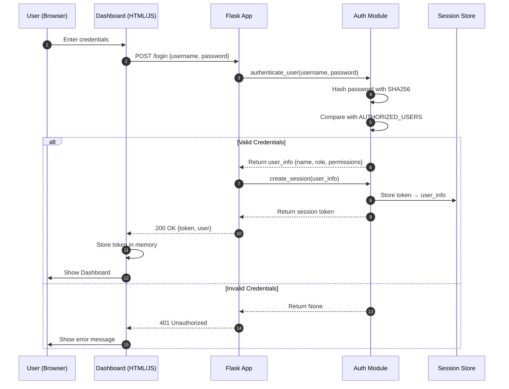
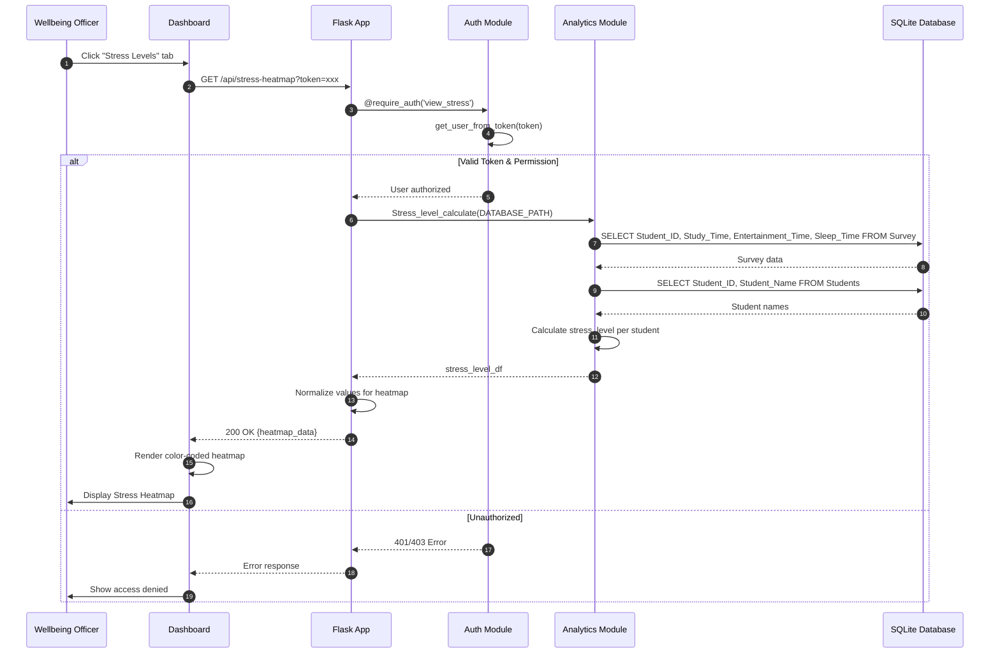
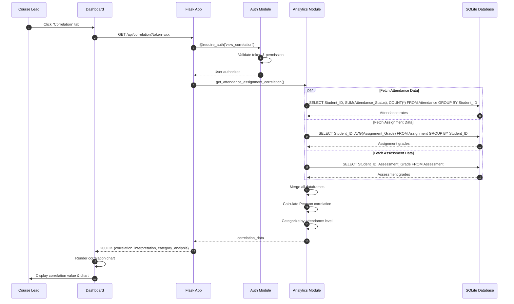
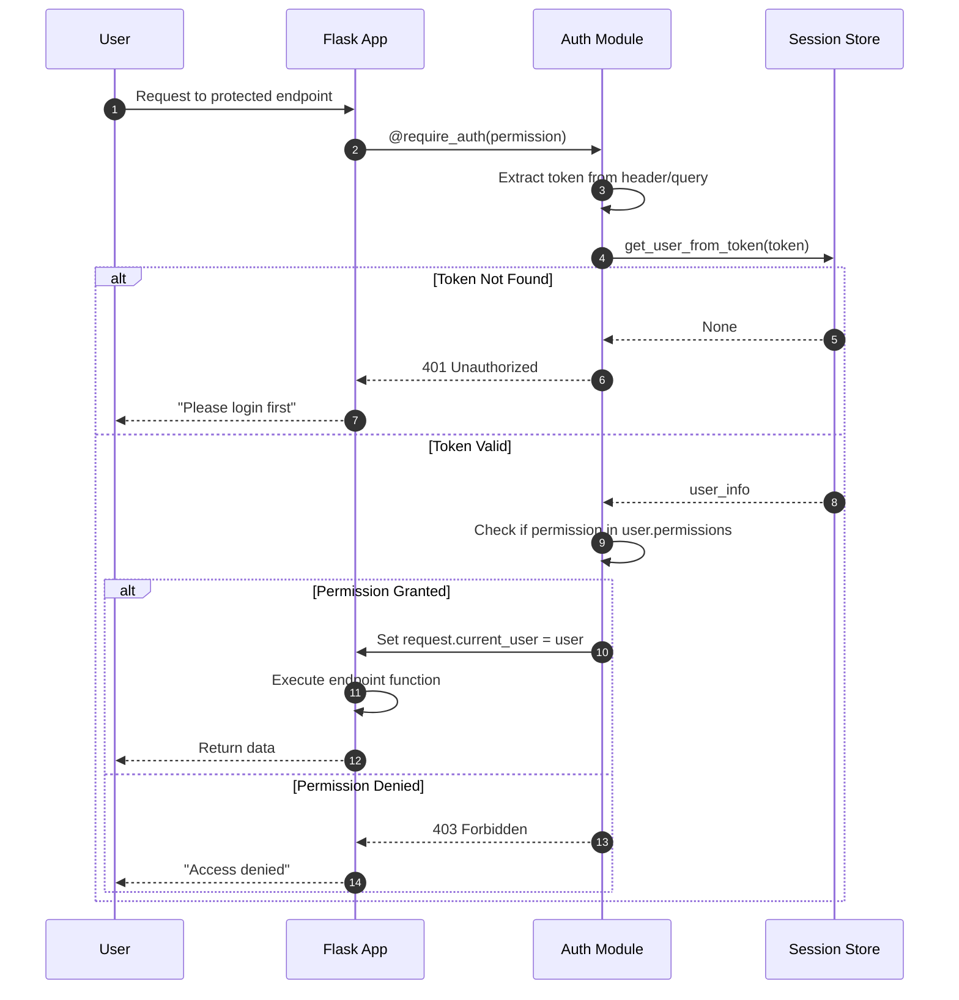
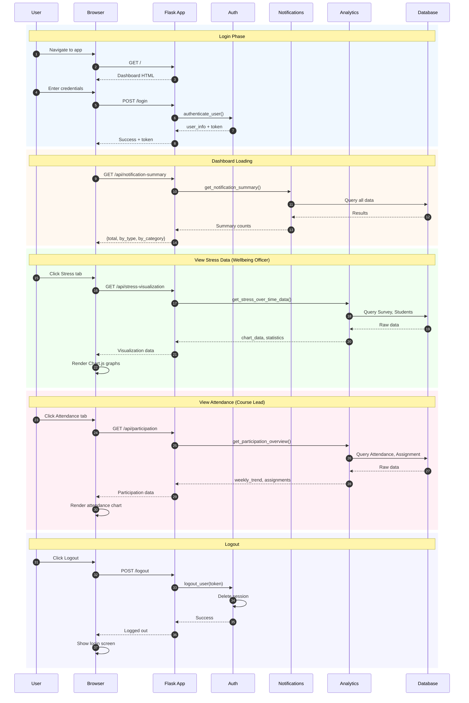
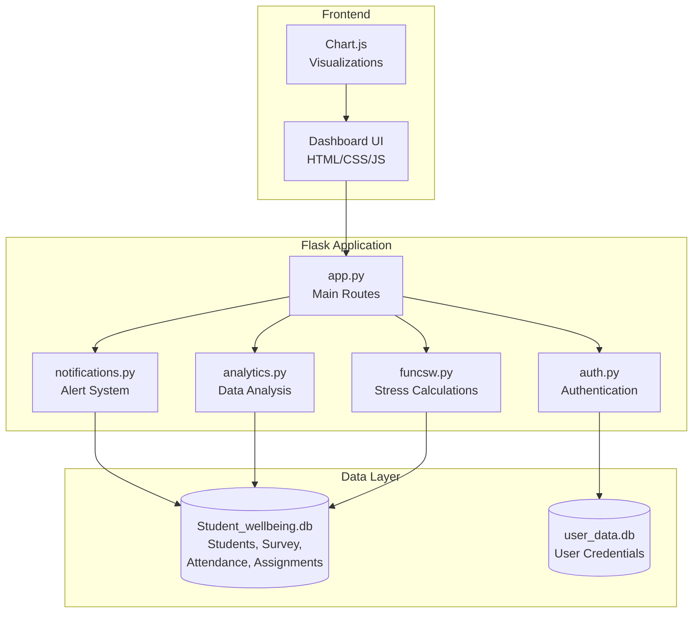

# UML Sequence Diagrams - Student Wellbeing Application

This document contains UML sequence diagrams for the Student Wellbeing Application.
You can render these using:
- **Mermaid**: GitHub, GitLab, VS Code with Mermaid extension
- **PlantUML**: Online at plantuml.com or VS Code with PlantUML extension

---

## 1. Authentication Flow (Login)

---

## 2. Wellbeing Officer - View Stress Heatmap

---

## 3. Course Lead - View Attendance Correlation

---

## 4. Notification System Flow

```mermaid
sequenceDiagram
    autonumber
    participant U as User
    participant D as Dashboard
    participant F as Flask App
    participant A as Auth Module
    participant N as Notifications Module
    participant AN as Analytics Module
    participant DB as SQLite Database

    U->>D: Click "Notifications" tab
    D->>F: GET /api/notifications?token=xxx
    F->>A: Validate token
    A-->>F: User info with role
    
    alt Wellbeing Officer
        F->>N: get_all_notifications(category='wellbeing')
    else Course Lead
        F->>N: get_all_notifications(category='attendance')
    else Admin
        F->>N: get_all_notifications()
    end
    
    par Generate Stress Alerts
        N->>AN: Stress_level_calculate()
        AN->>DB: Query Survey + Students
        DB-->>AN: Data
        AN-->>N: stress_df
        N->>N: Filter stress_level > 3
        N->>N: Create HIGH_STRESS alerts
    and Generate Sleep Alerts
        N->>N: Filter Sleep_Time < 6
        N->>N: Create LOW_SLEEP alerts
    and Generate Attendance Alerts
        N->>DB: Query Attendance
        DB-->>N: Attendance data
        N->>N: Calculate attendance rates
        N->>N: Filter rate < 70%
        N->>N: Create LOW_ATTENDANCE alerts
    end
    
    N->>N: Sort by severity
    N-->>F: All alerts
    F-->>D: 200 OK {notifications}
    D->>D: Render alert list with badges
    D->>U: Display notifications
```

---

## 5. Role-Based Access Control Flow

---

## 6. Complete User Session Flow

---

## Component Overview Diagram

---

## How to Render These Diagrams

### Option 1: VS Code
1. Install "Markdown Preview Mermaid Support" extension
2. Open this file and press `Ctrl+Shift+V` to preview

### Option 2: GitHub/GitLab
- Just commit this file - diagrams render automatically

### Option 3: Online
- Copy Mermaid code to [mermaid.live](https://mermaid.live)

### Option 4: PlantUML
Convert Mermaid to PlantUML syntax and use [plantuml.com](https://www.plantuml.com/plantuml/uml/)
